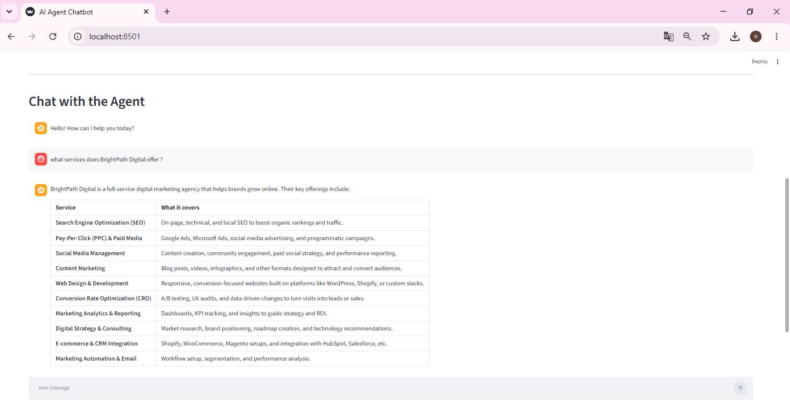
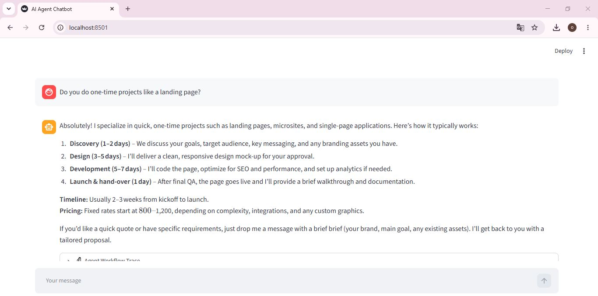
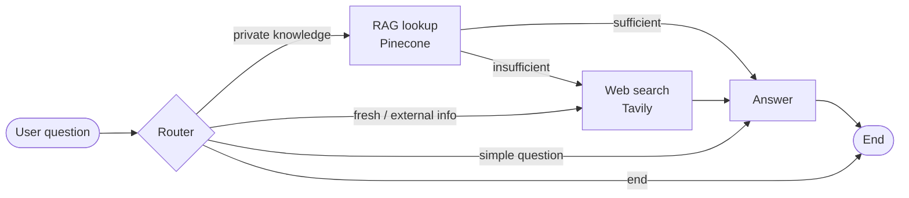

# 🤖 Smart RAG Agent – LangGraph, Pinecone & Web Search

An AI agent that answers questions by deciding **on its own** whether to use a private knowledge base (RAG), a real-time web search, or just the LLM. Built with **LangGraph**, **FastAPI**, **Streamlit**, **Pinecone** and **Groq**.

## 📌 Overview

Most chatbots either rely on the model's memory or always search the web. This project adds a **decision layer**: a router chooses the best source for each question, an LLM judge checks whether the retrieved documents are good enough, and the agent falls back to web search only when needed. Every step is shown to the user in an **agent trace**.

## 📸 Demo

**1. Upload a PDF and choose whether the agent may search the web**


**2. Ask a question: the agent answers from the uploaded document (RAG)**



**3. Follow-up question with memory, plus an expandable "Agent Workflow Trace"**



## ✨ Key Features

- **Intelligent routing:** a router node picks RAG, web search, a direct answer, or ends the conversation.
- **RAG sufficiency check:** an LLM judges whether retrieved passages actually answer the question before using them.
- **User-controlled web search:** a UI toggle enables or disables internet access.
- **Transparent workflow:** the agent trace shows routing decisions, the RAG verdict and retrieval summaries.
- **PDF upload:** documents are split into chunks, embedded and indexed in Pinecone from the interface.
- **Conversation memory:** LangGraph checkpointing keeps context across turns.
- **Modular design:** separate frontend, API and agent layers.

## 🧠 Agent Workflow



## 🧰 Tech Stack

| Layer | Tools |
|---|---|
| Frontend | Streamlit |
| API | FastAPI, Uvicorn |
| Agent orchestration | LangGraph, LangChain |
| LLM | Groq API |
| Embeddings | `sentence-transformers/all-MiniLM-L6-v2` (384 dimensions) |
| Vector database | Pinecone |
| Web search | Tavily API |
| PDF processing | PyPDFLoader |
| Language | Python 3.10+ |

## 📁 Project Structure

```
rag_agent_app/
├── backend/
│   ├── main.py            # FastAPI app (upload, chat, health endpoints)
│   ├── agent.py           # LangGraph agent: router, RAG, web search, answer
│   ├── vectorstore.py     # Pinecone indexing and retrieval
│   ├── config.py          # Environment variables
│   └── check_models.py    # Lists the Groq models available to your key
├── frontend/
│   ├── app.py             # Streamlit entry point
│   ├── ui_components.py   # Chat UI, upload section, web-search toggle, trace
│   ├── backend_api.py     # Calls to the FastAPI backend
│   ├── session_manager.py # Streamlit session state
│   └── config.py          # Frontend configuration
├── sample_docs/
│   └── DIABETES.pdf       # Sample document to try the RAG
├── requirements.txt
├── .env.example
└── README.md
```

## ▶️ Getting Started

**Prerequisites:** Python 3.10+ and free API keys for [Groq](https://console.groq.com/keys), [Pinecone](https://www.pinecone.io/) and [Tavily](https://tavily.com/).

**1. Clone and install**
```bash
git clone https://github.com/oumaima-bn/Smart-RAG-Agent-LangGraph-Pinecone-Web-Search.git
cd Smart-RAG-Agent-LangGraph-Pinecone-Web-Search

python -m venv .venv
.venv\Scripts\activate          # Windows
# source .venv/bin/activate     # Mac / Linux

pip install -r requirements.txt
```

**2. Configure your keys**
Copy `.env.example` to `.env` and fill in your values:
```dotenv
GROQ_API_KEY="your_groq_api_key"
PINECONE_API_KEY="your_pinecone_api_key"
PINECONE_ENVIRONMENT="us-east-1"
PINECONE_INDEX_NAME="rag-index"
TAVILY_API_KEY="your_tavily_api_key"
FASTAPI_BASE_URL="http://localhost:8000"
GROQ_MODEL="openai/gpt-oss-120b"
```
> 🔒 Never commit your `.env` file. It is listed in `.gitignore`.

The Pinecone index (`rag-index`, 384 dimensions, cosine metric) is created automatically on first use if it does not exist.

Groq retires models regularly. Run `python backend/check_models.py` to list the models available to your key, then update `GROQ_MODEL` if needed.

**3. Start the backend (FastAPI)**
```bash
cd backend
uvicorn main:app --reload --host 0.0.0.0 --port 8000
```

**4. Start the frontend (Streamlit)** in a second terminal, from the project root:
```bash
streamlit run frontend/app.py
```
The app opens at `http://localhost:8501`. Upload a PDF (for example `sample_docs/DIABETES.pdf`), then ask a question about it.

## 🔌 API Endpoints

| Method | Endpoint | Description |
|---|---|---|
| POST | `/upload-document/` | Upload a PDF, split it into chunks and index it in Pinecone |
| POST | `/chat/` | Send a question and get the answer with the agent trace |
| GET | `/health` | Check that the API is running |

**Example – `/chat/`**
```json
{
  "session_id": "test-session-001",
  "query": "What are the treatments of diabetes?",
  "enable_web_search": true
}
```
The response contains the final `response` and a list of `trace_events` (step, node name, description, event type).

## 🔭 Future Improvements

- Stream the LLM answer token by token
- Add reranking and multi-query retrieval
- Long-term memory for chat history
- User authentication and profiles
- Additional tools (calculator, code interpreter)

## 👤 Author

**Oumaima Bendjaj** · [GitHub](https://github.com/oumaima-bn) · [LinkedIn](https://linkedin.com/in/your-profile)
